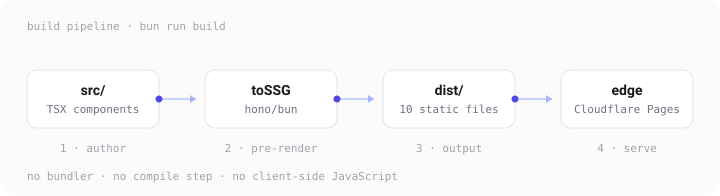
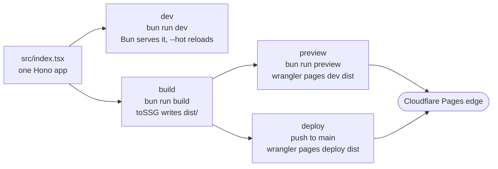
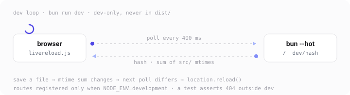
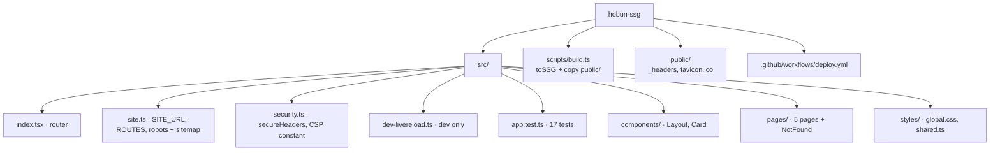
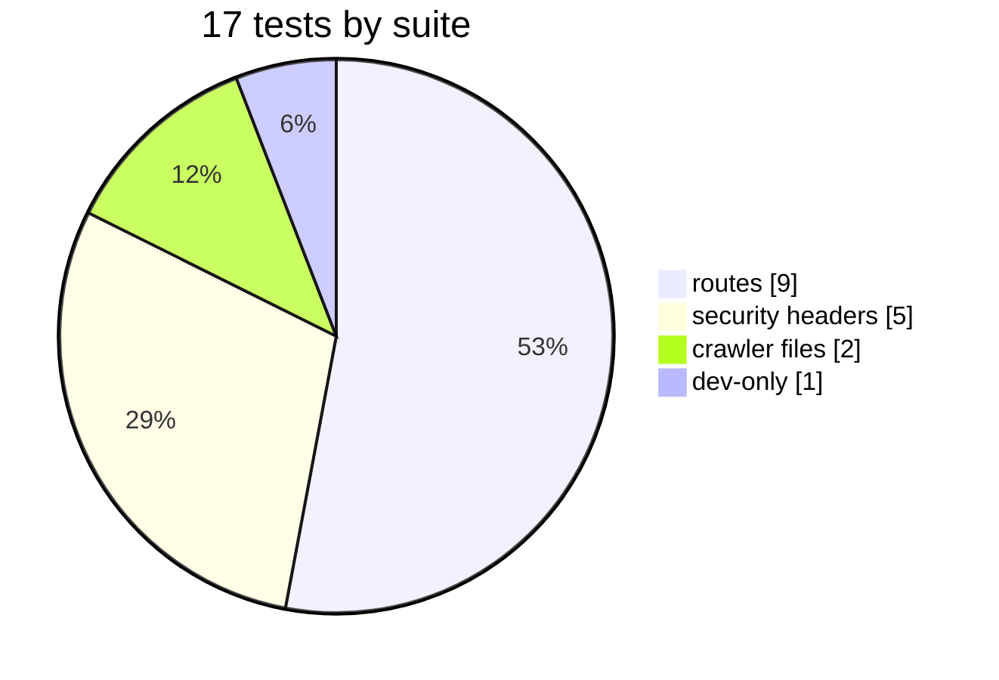
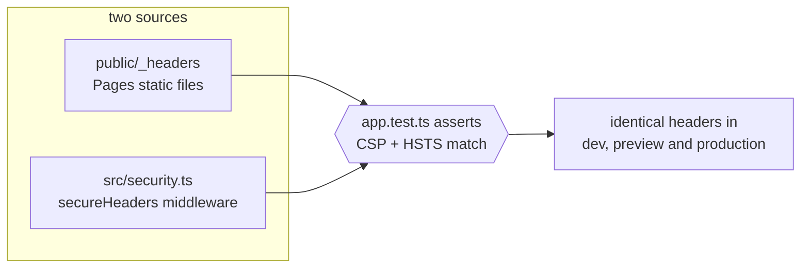
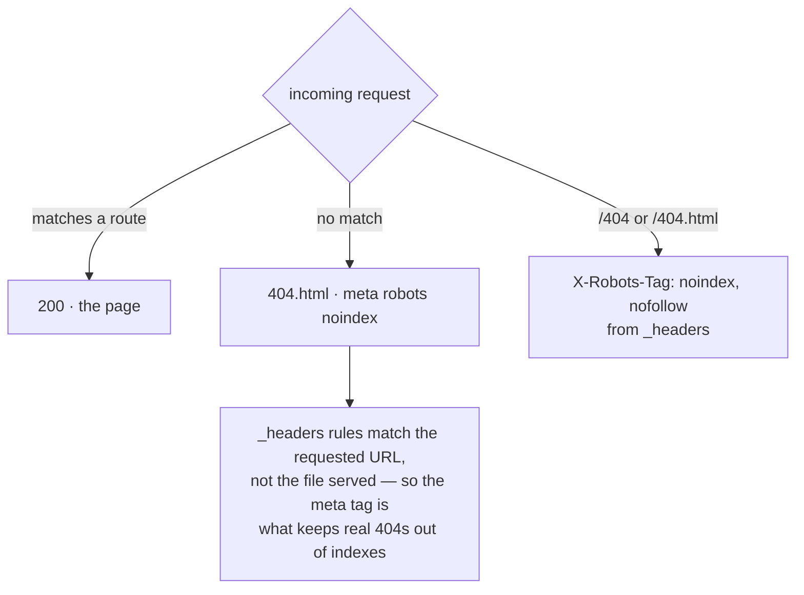
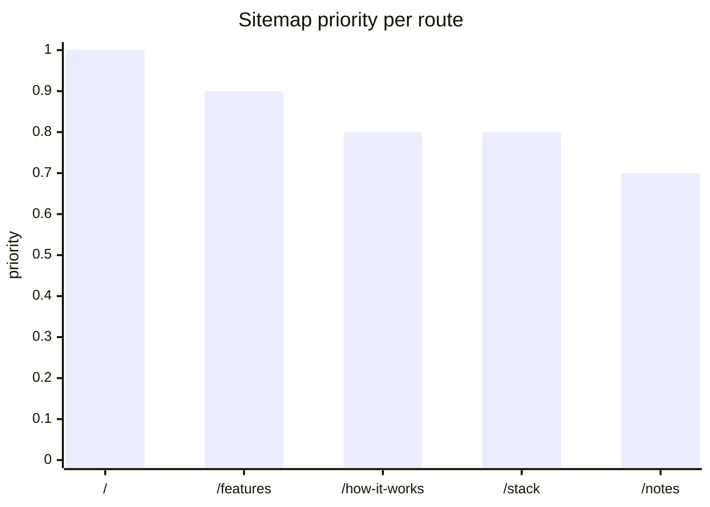
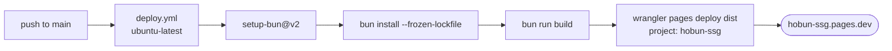

# hobun

**A [Hono](https://hono.dev) app, pre-rendered to static HTML, served from Cloudflare Pages.**
Live: <https://hobun-ssg.pages.dev>

A learning project that doubles as its own write-up: one Hono app, one runtime dependency, zero client-side JavaScript.



- **One app, many outputs.** Every page is a JSX component; `toSSG` bakes each route into a real HTML file.
- **No bundler, no compile step.** Bun transpiles the TSX at runtime; `scripts/build.ts` is the entire build system.
- **Zero client JS.** Which is what makes the strict CSP possible — there is nothing to exempt.
- **Bun is the whole toolchain:** serve, transpile, build, test. `wrangler` is the only npm-ecosystem binary, kept for the Pages-shaped preview and deploy.

## Stack

| Tool | Version | Role |
| --- | --- | --- |
| [Bun](https://bun.com/docs) | 1.4.2 | runtime, package manager, TSX transpiler, test runner |
| [Hono](https://hono.dev) | 4.13.8 | routing, JSX rendering, middleware, `toSSG` |
| [TypeScript](https://www.typescriptlang.org) | 7.0.2 | `tsc --noEmit` only — nothing is ever compiled |
| [Wrangler](https://developers.cloudflare.com/workers/wrangler/) | 4.135.0 | `wrangler pages dev dist`, and `pages deploy` in CI |
| Cloudflare Pages | — | host; serves `dist/` from the edge |

Versions above are what `bun.lock` resolves; `bun install --frozen-lockfile` reproduces them exactly. `hono` is the only runtime dependency in `package.json`.

## One app, four lives



```sh
bun install         # install; bun.lock is committed
bun run dev         # :3000, server hot-reload + browser auto-refresh
bun run build       # pre-render every route into dist/
bun run preview     # serve dist/ with real Pages semantics
bun test            # 17 tests, 45 assertions
bun run typecheck   # tsc --noEmit
```

### Dev: `--hot` plus a hand-rolled browser reload



Bun's `--hot` re-evaluates the *server* on save and pushes nothing to the browser. So `Layout` injects `/__dev/livereload.js` in dev only — a real file, not inline code, so the CSP stays strict. Both `/__dev/*` routes are registered only when `NODE_ENV=development`.

### Build: `toSSG`, then copy `public/`

`scripts/build.ts` does three things: `rmSync(dist)`, `toSSG(app, { dir: dist })`, `cpSync(public, dist)`. Ten files come out — five pages, `404.html`, `robots.txt`, `sitemap.xml`, `favicon.ico`, `_headers`.

CSS is scoped by `hono/css`: stable class names, deduped at render time, emitted inline. Each page ships only the CSS it used; `dist/404.html` contains a strict subset of `index.html`'s class names. True globals live in `src/styles/global.css` and are inlined everywhere. Styling costs zero requests.

### Preview: the only honest local stand-in

A plain static server does not behave like Pages. `wrangler pages dev dist` gives the real shape: unmatched paths return a genuine `404`, `_headers` is parsed and applied, and `404.html` is used as the custom error page.

## Where things live



## Tests



`bun:test` plus the app's own `app.request()` — no framework, no supertest, no test doubles. `bun test` sets `NODE_ENV=test`, so the suite always runs in production shape. Coverage: route status and content, HEAD-without-body, the CSP and header values, `X-Robots-Tag` on 404s, robots/sitemap contents, and that `/__dev/*` 404s outside dev. One test also diffs `public/_headers` against `src/security.ts` so the two cannot drift.

## Security headers: two sources, one contract



The wildcard rule sets **11 headers**, including a **13-directive** CSP and a Permissions-Policy covering **22** features. Hono's three legacy defaults (`X-XSS-Protection`, `X-Download-Options`, `Origin-Agent-Cluster`) are disabled so app responses carry exactly what `_headers` defines.

- `script-src` has no `'unsafe-inline'` in any environment — possible only because nothing injects inline bootstrap code.
- `style-src` allows `'unsafe-inline'`; that is the single exception, and inline styles need it.
- `https://static.cloudflareinsights.com` (script) and `https://cloudflareinsights.com` (connect) are allowed for Cloudflare Web Analytics. **No page loads a beacon today** — the allowance is reserved, not used.
- `X-Robots-Tag` is deliberately **not** on the wildcard rule; see below.

## 404, layered



Static and dynamic halves: `/404` is a normal route, so `toSSG` writes `dist/404.html` and Pages serves it for unmatched paths; `app.notFound` returns the same styled page in dev with a real `404` status. A tiny middleware adds `X-Robots-Tag` to app-generated 404s.

## Crawler files are routes

`/robots.txt` and `/sitemap.xml` are real routes, so dev serves them exactly like production and `toSSG` pre-renders them — the deployed copies cannot go stale. The sitemap is generated from `ROUTES` in `src/site.ts`, the single source of truth.



Each entry carries `lastmod` (build date), `changefreq` (all monthly) and `xhtml:link` hreflang alternates (`en` + `x-default`). `/404` is deliberately absent from `ROUTES` — it is noindex, so listing it would be nonsense.

## Deploy



GitHub Actions does the deploy, not Pages' Git integration. It needs two repository secrets: `CLOUDFLARE_API_TOKEN` and `CLOUDFLARE_ACCOUNT_ID`. Runs are serialised by the `pages-deploy` concurrency group and can also be triggered by hand (`workflow_dispatch`).

## Adding a page

```tsx
// 1. src/pages/LearnPage.tsx
import { Layout } from '../components/Layout'

export function LearnPage() {
  return (
    <Layout title="Learn" description="..." path="/learn">
      <h1>Learn</h1>
    </Layout>
  )
}
```

```tsx
// 2. src/index.tsx
app.get('/learn', (c) => c.html(<LearnPage />))
```

```ts
// 3. src/site.ts — add to ROUTES or it never reaches the sitemap
{ path: '/learn', changefreq: 'monthly', priority: '0.7' },
```

`path` is required on `Layout`: it builds the canonical and hreflang URLs, so a page without it fails typecheck. `active` is optional — add the page's key to the `PageKey` union in `Layout` to light up the nav. For dynamic routes use `ssgParams`; for routes that must never be pre-rendered, `disableSSG`.

## Gotchas

- **TypeScript 6/7 no longer auto-discovers `@types`.** Without `"types": ["bun"]` in `tsconfig.json`, Bun globals do not resolve.
- **Bun has no `?raw` import.** CSS comes in via `with { type: 'text' }`, backed by `src/text-imports.d.ts`.
- **Pages matches `_headers` against the requested URL, not the served file.** A `noindex` rule can never target real unmatched paths.
- **`hono/css` dedupes by class at render time.** A page cannot emit styles for components it never rendered; that is the whole mechanism.

## Accessibility

Every page gets, from `Layout`: doctype, `lang="en"`, per-page title and description, explicit `<meta name="robots">`, canonical and self-referencing hreflang alternates, and Open Graph tags. The shell has a skip link to `<main>` (focus ring suppressed on `main` so it is not noise), `aria-current="page"` on the active nav link, `:focus-visible` outlines, underlined in-text links so they do not rely on colour alone, and a `prefers-reduced-motion` block that kills transitions and animations.

## License

[MIT](LICENSE).