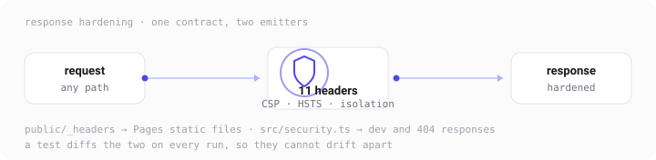
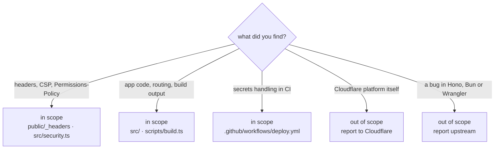
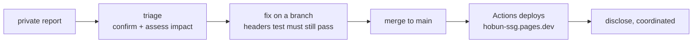

# Security Policy

The site is static: no server-side code runs in production, no client-side JavaScript ships, and there is no database or user data. The security surface is therefore small and mostly configuration.

## Supported

Only the `main` branch is maintained. There are no versioned releases or published packages, so a report should always be against the current commit.

## What is in scope

## How to report

**Do not open a public issue with exploit details, credentials, or private data.** Use private channels:

1. GitHub's **Report a vulnerability** (Security Advisories) on this repository — preferred, it keeps the thread private until a fix lands.
2. Otherwise contact `c0k0n` through [the GitHub profile](https://github.com/c0k0n).

Include: the affected file or commit, reproduction steps, the impact you believe it has, and safe supporting evidence (header dumps, a curl transcript — not anyone's private data).

## What to expect

This is a learning project, so response and fixes are best-effort. Please allow time for investigation before making a report public.

A useful detail when assessing header reports: the same policy is emitted twice, once by `public/_headers` for Pages static files and once by `src/security.ts` for app responses, and `bun test` asserts the two match. A finding against one is a finding against both.
